# IntelleCraft — EdTech platform

A single Next.js application. The UI is rendered by Next; the API is an Express
app mounted behind one catch-all route (`src/pages/api/v1/[...path].ts`), so
every endpoint lives under `/api/v1/*` in the same deployment. There is no
separate backend process.

## Screenshots

### Homepage

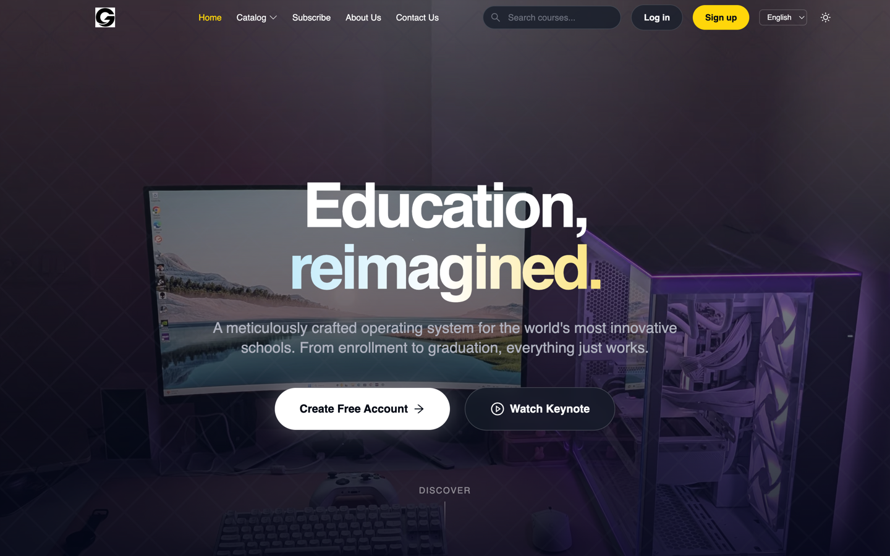

### Catalog

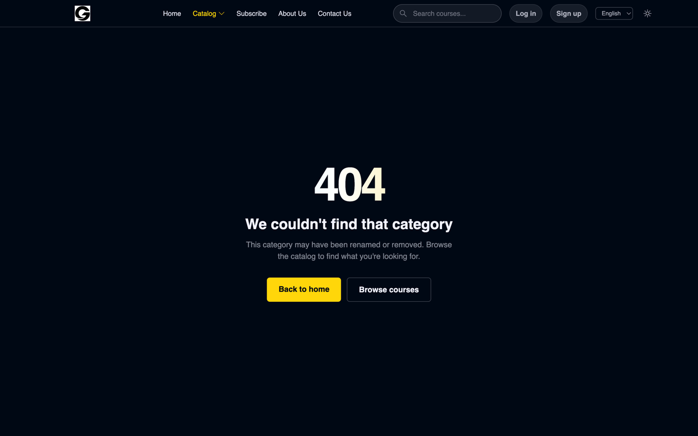

### Search

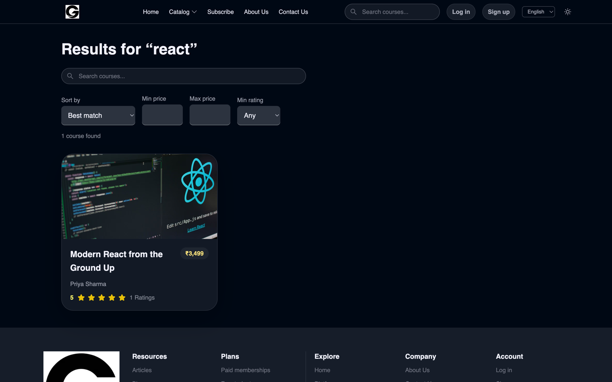

### Course details


### Sign in

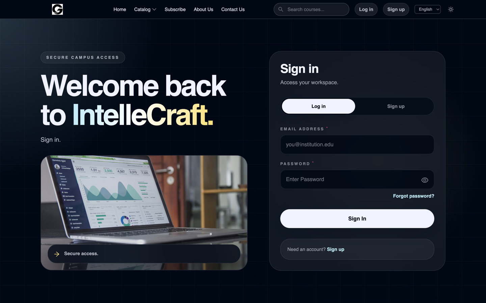

### Sign up

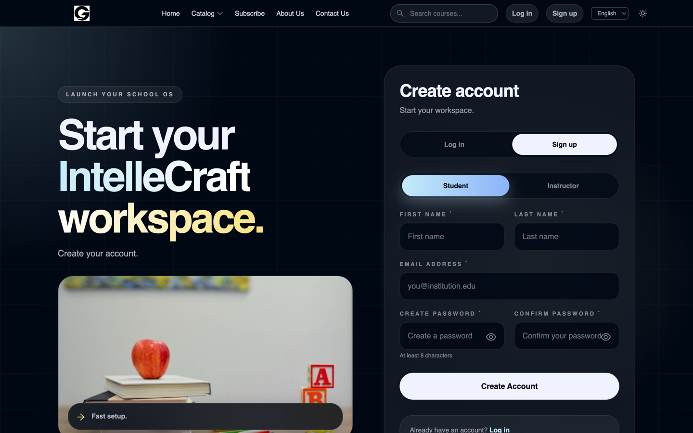

### Student dashboard

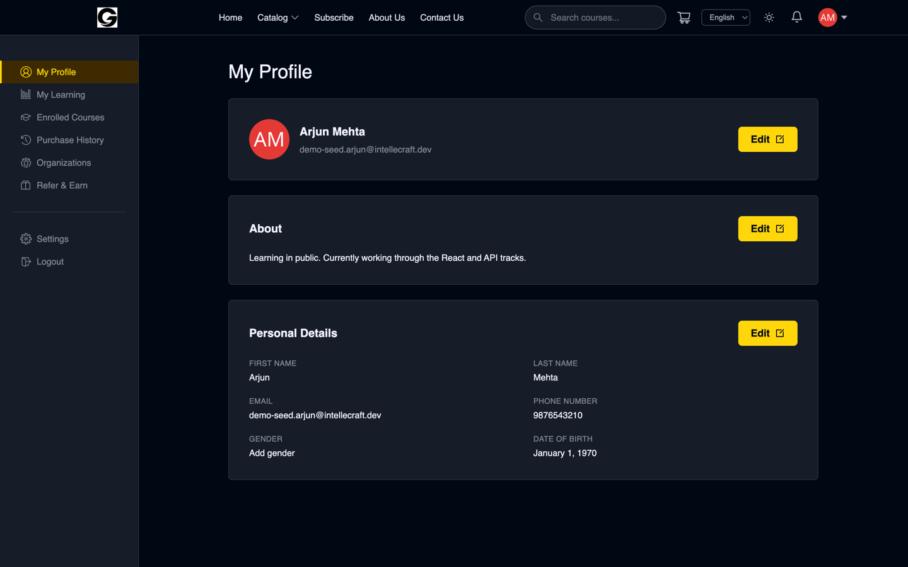

### Enrolled courses

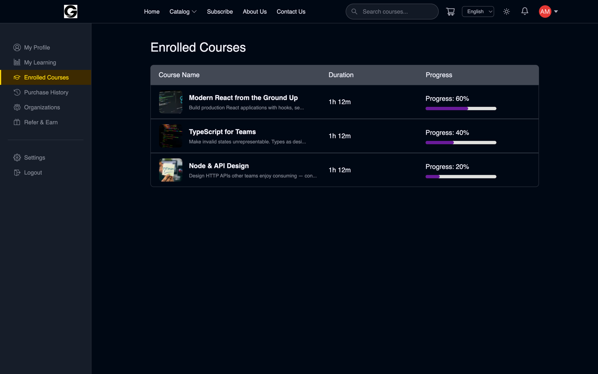

### My learning

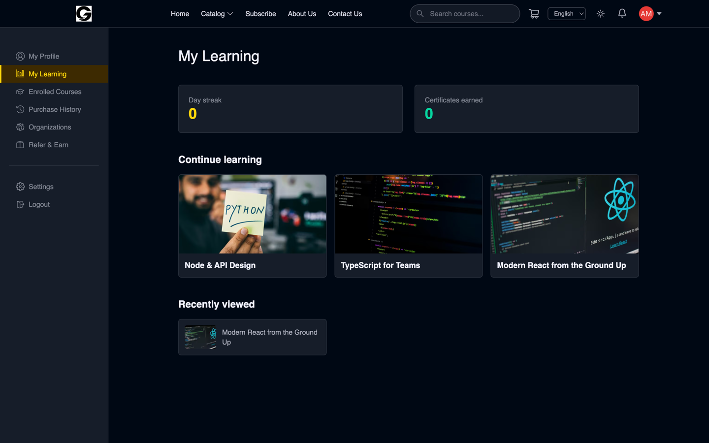

### Course player


### Purchase history

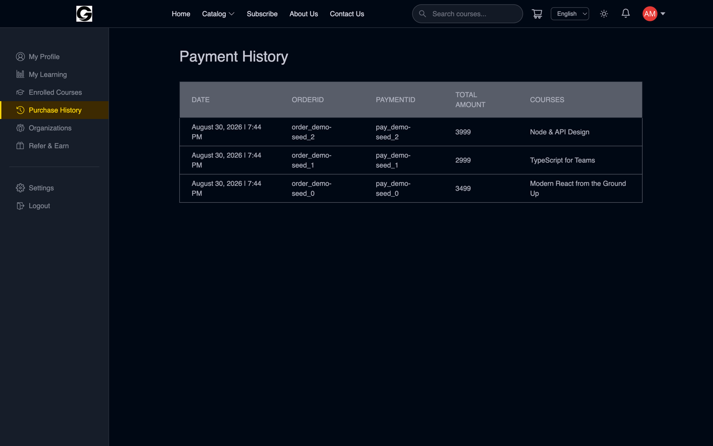

### Settings

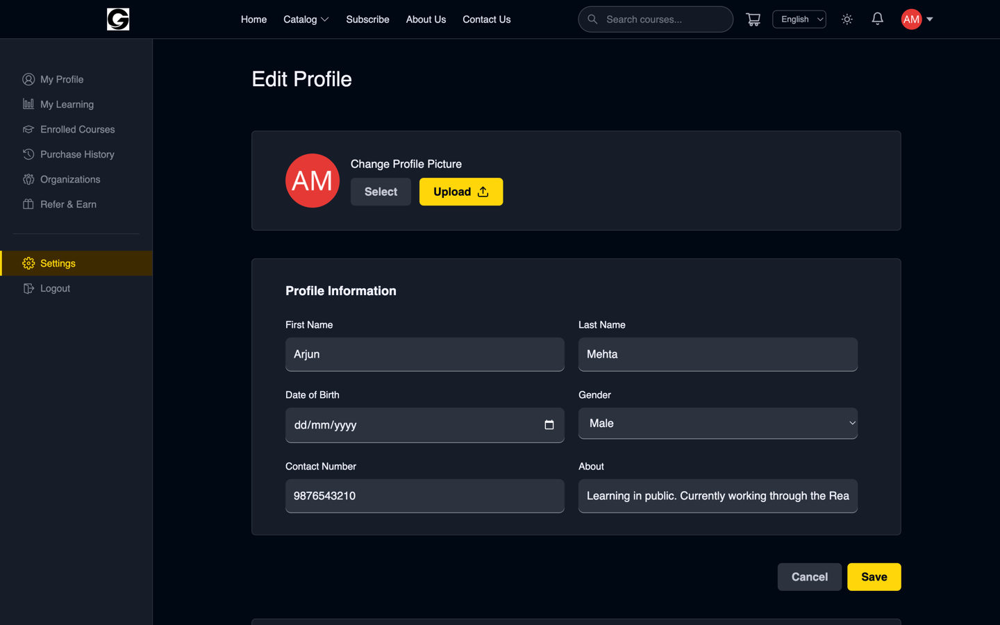

### Instructor dashboard

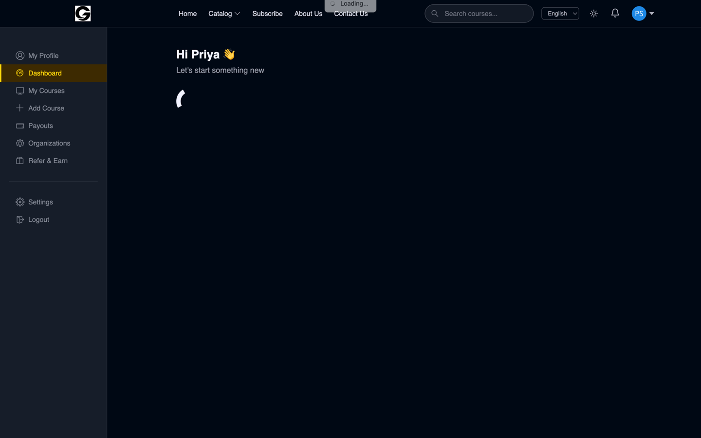

### Instructor courses

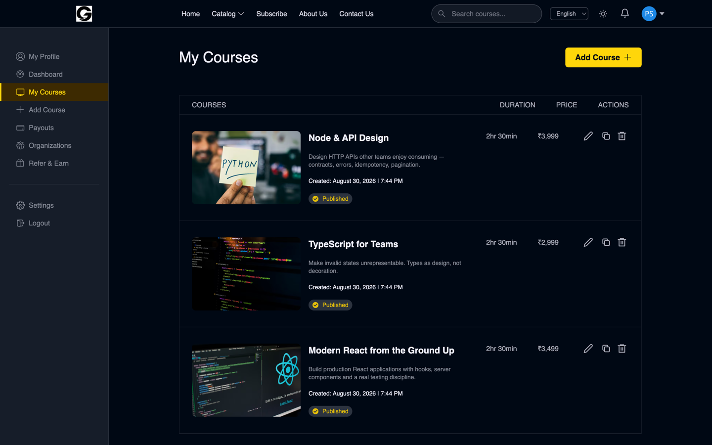

### Course builder

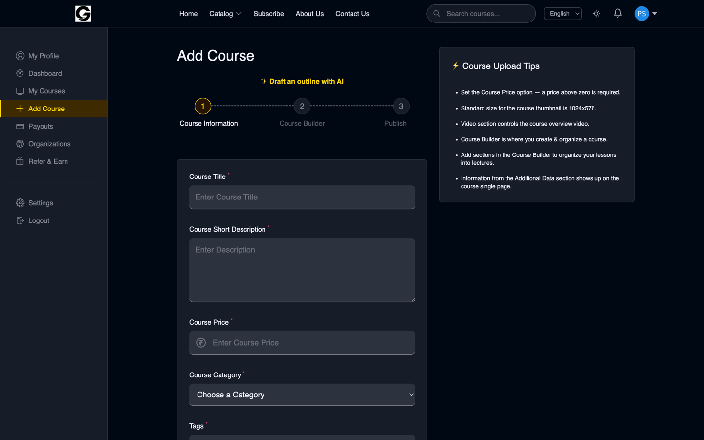

### Admin dashboard

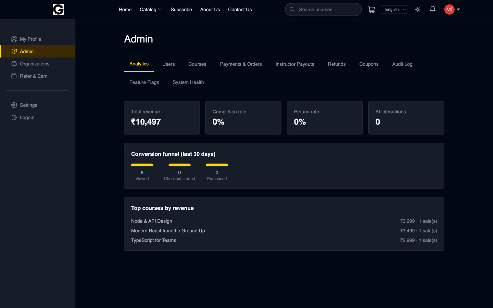

### Mobile — homepage

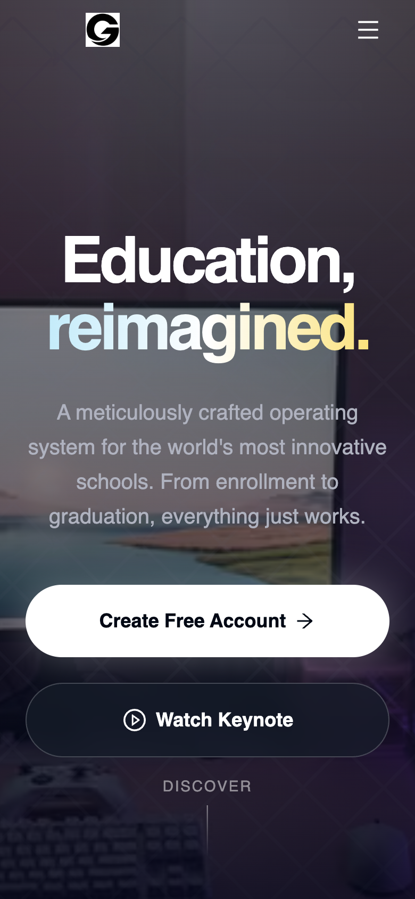

### Mobile — enrolled courses


### Mobile — instructor dashboard


## Run locally

```bash
npm install
cp .env.example .env.local   # then fill it in
npm run dev                  # http://localhost:3000
```

Only `MONGODB_CONNECTION_URL` and `JWT_SECRET` are required to boot. Everything
else degrades explicitly: mail, media, payments and AI endpoints each report
"not configured" rather than failing opaquely.

## Verify

```bash
npm run verify   # typecheck + lint + unit tests + integration tests
npm run build    # production build; typecheck and lint gate it
```

`next.config.js` deliberately does NOT set `typescript.ignoreBuildErrors` or
`eslint.ignoreDuringBuilds` — a green build is meant to mean something.

### Two test suites, on purpose

```bash
npm run test              # unit — fast, data layer mocked
npm run test:integration  # integration — real controllers, real database
```

**Unit tests** (`*.test.ts`) mock the data layer to test one decision in
isolation: HMAC verification, field encryption, the validation primitives that
reject a Mongo operator where a string belongs.

**Integration tests** (`*.itest.ts`) run the actual Express app against a real
MongoDB started in-process, through real HTTP. Routing, auth middleware, Zod
validation, controller, Mongoose write, response — none of it is stubbed.
Only three modules are swapped, in `vitest.integration.mts`: the Razorpay,
Cloudinary and nodemailer SDKs, because those are the only parts that cannot
run without a third-party account. Nothing in `src/api` is faked.

**No API keys or configuration are needed.** The suite provides its own
environment and its own database, so `npm run test:integration` works on a
clean checkout. The first run downloads a MongoDB binary (~100MB, cached
afterwards); later runs are offline.

This split exists because the two want opposite things. A mocked test proves a
function branches correctly; it cannot tell you whether a purchase actually
enrols anybody. The integration suite covers the paths where that distinction
matters: checkout and settlement, webhook delivery and replay, refund
idempotency, signup through a real OTP, password reset, session revocation,
cross-tenant authorization, quiz grading and certificate issuance.

It has already earned its keep. On its first run it caught `User.referralCode`
being declared `unique + sparse` *with* `default: null` — sparse only skips
documents where the field is absent, so a present-and-null value still
participates and only one user in the entire database could exist without a
referral code. It never fired in production only because `autoIndex` is off and
the index was never built; any `syncIndexes()` would have broken every signup
after the first.

## Deploying

**Run the migration before deploying, not after:**

```bash
npm run migrate:indexes
```

It is idempotent and safe to re-run. `autoIndex` is off (see
`src/api/config/connectDB.ts`) so that a cold start never tries to build a
unique index against unresolved duplicate data and crash the function — which
makes this script the *only* thing that creates indexes. It:

- normalises user emails to lowercase and refuses to continue if that surfaces
  genuine duplicate accounts (merging two accounts is a decision, not a script);
- creates the unique indexes the payment, enrolment, review and referral upserts
  depend on for idempotency;
- creates the TTL indexes for OTPs, sessions and rate-limit windows.

Skipping it does not fail loudly — it fails quietly and later, which is why it
is a documented step rather than something the app does on boot.

Cron endpoints (`/api/v1/cron/*`) are driven by the schedule in `vercel.json`
and authenticate with `CRON_SECRET`. They refuse every request when it is unset.

## Environment

`.env.example` is the template and documents every variable. The ones that must
be set in production, and what breaks without them:

| Variable | Without it |
| --- | --- |
| `MONGODB_CONNECTION_URL` | Nothing starts. |
| `JWT_SECRET` | Nothing starts. Use ≥32 random characters. |
| `APP_BASE_URL` | Password-reset links are wrong. Never taken from the request Host header — that would let an attacker aim a victim's reset link at their own domain. |
| `WEBHOOK_SECRET` | Razorpay webhooks are rejected, so enrolment stops surviving a closed tab. |
| `CRON_SECRET` | Scheduled publishing and transcription refuse to run. |
| `FIELD_ENCRYPTION_KEY` | Instructor payout endpoints fail rather than store bank details unencrypted. |
| `NEXT_PUBLIC_RAZORPAY_KEY` | Checkout is disabled in the browser. Baked in at build time. |

Nothing in `src/api/config/env.ts` is `NEXT_PUBLIC_`, so no server secret can
reach the client bundle.

## Structure

| Path | Responsibility |
| --- | --- |
| `src/app` | App Router pages, layouts and metadata |
| `src/ui` | Client components, Redux slices, API client operations |
| `src/api/routes` | HTTP surface: method, path, auth, rate limits |
| `src/api/controllers` | Request handling and business rules |
| `src/api/models` | Mongoose schemas and indexes |
| `src/api/lib` | Shared primitives — validation, responses, errors, crypto |
| `src/api/middlewares` | Authentication, role guards, rate limiting |
| `src/types` | Domain and wire types shared by both halves |
| `src/lib` | Layer-neutral helpers used by both `api` and `ui` |
| `scripts` | Operational scripts (indexes, backfills, restore verification) |

### Conventions worth knowing before changing anything

- **Validate at the boundary.** Every `req.body`, `req.query` and `req.params`
  goes through `parseOrThrow` with a Zod schema built from `src/api/lib/schemas.ts`.
  This is not style: Express parses `{"token":{"$gt":""}}` into an object and
  Mongoose accepts `$gt` as an operator, so an unvalidated value reaching a query
  is a working NoSQL injection.
- **`respond.ts` builds every response body.** It is the only place a caught
  error becomes a string a user sees, which is what keeps stack traces and
  driver messages out of responses.
- **Ownership checks are part of the query,** not a separate read — and they
  start from the resource being mutated, never from a caller-supplied parent id.
- **Money and grades are server-authoritative.** Amounts come from the stored
  `Order`, quiz answers from the stored key. The client never gets a vote.
- **Wrap every route** in `asyncHandler`/`authedHandler`. Express 4 does not
  await handlers, so an unwrapped async route that throws hangs the client.
